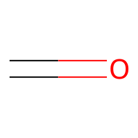
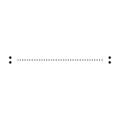
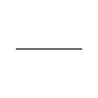
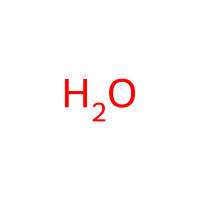
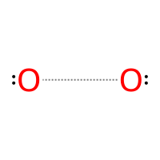

# Molecule Data

| Molecules SMILES | Molecules | 
|-----------|-----------|
| [CH]~[CH] |  |
| [CH4] |  |
| [C]$[C] |  |
| [CH3][OH] |  |
| [C]~[C] |  |
| [O]~[O] |  |
| [CH2]=[CH2] |  |
| [CH]#[CH] |  |
| [CH2]=[O] |  |
| [O]=[O] |  |
| [OH][OH] |  |
| [CH3][CH3] |  |
| [OH2] |  |
| [CH2]~[O] |  |
| [CH2]~[CH2] |  |