# Reaction Data

| Reactants SMILES | Products SMILES | Reactants | Products |
|-----------|----------|-----------|-----------|
| `[CH2]~[O] + [O]~[O]` | `[CH2]~[O]~[O]~[O]` | 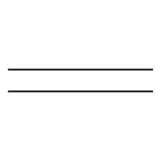 |  |
| `[CH2]~[O] + [C]~[C]` | `[C]~[C]=[CH2]~[O]` |  | 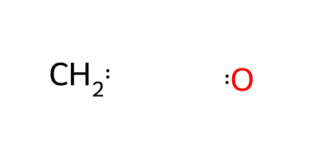 |
| `[C]$[C]` | `[C] + [C]` |  |  |
| `[CH2]~[CH2] + [CH2]~[O]` | `[CH2]~[CH2][O]~[CH2]` |  | 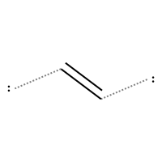 |
| `[CH2]=[O]` | `[CH2] + [O]` |  | 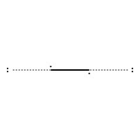 |
| `[CH2]~[O] + [CH2]~[O]` | `[CH2]~[O]=[CH2]~[O]` |  |  |
| `[CH2]~[CH2] + [CH2]~[O]` | `[CH2]~[CH2]~[CH2]~[O]` |  | 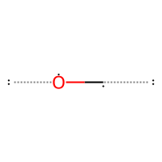 |
| `[CH]~[CH] + [CH2]~[O]` | `[CH]~[CH]~[O]~[CH2]` |  | 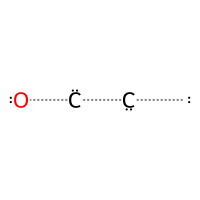 |
| `[CH]~[CH] + [CH2]~[O]` | `[CH]~[CH][O]~[CH2]` |  | 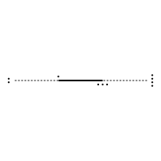 |
| `[C]~[C] + [CH2]~[O]` | `[C]~[C]~[O]~[CH2]` |  | 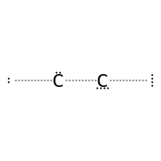 |
| `[CH3][CH3]` | `[CH3] + [CH3]` | 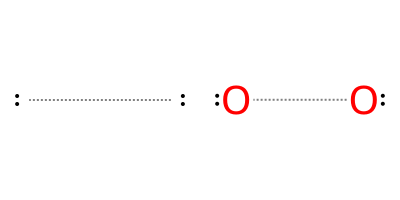 | 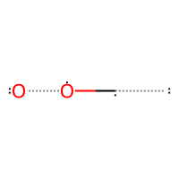 |
| `[O]~[O] + [CH2]~[CH2]` | `[CH2]~[CH2]~[O]~[O]` |  |  |
| `[CH]~[CH] + [O]~[O]` | `[CH]~[CH]=[O]~[O]` |  | 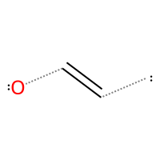 |
| `[CH2]~[CH2] + [CH2]~[O]` | `[CH2]~[CH2]=[CH2]~[O]` |  | 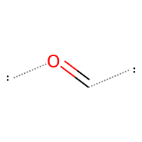 |
| `[C]~[C] + [C]~[C]` | `[C]~[C]~[C]~[C]` |  |  |
| `[CH2]~[CH2] + [C]~[C]` | `[C]~[C]~[CH2]~[CH2]` |  | 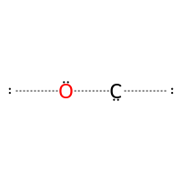 |
| `[CH2]~[CH2]` | `[CH2] + [CH2]` |  | 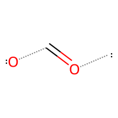 |
| `[CH]~[CH] + [CH2]~[O]` | `[CH]~[CH]=[O]~[CH2]` |  | 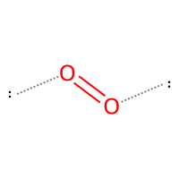 |
| `[C]~[C] + [CH2]~[O]` | `[C]~[C][CH2]~[O]` |  | 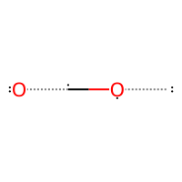 |
| `[CH2]~[O] + [C]~[C]` | `[C]~[C]~[CH2]~[O]` |  | 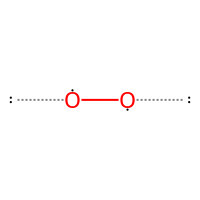 |
| `[CH2]~[O] + [O]~[O]` | `[O]~[CH2][O]~[O]` |  | 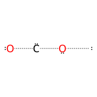 |
| `[CH2]~[CH2] + [CH2]~[CH2]` | `[CH2]~[CH2]=[CH2]~[CH2]` |  | 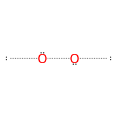 |
| `[CH]~[CH]` | `[CH] + [CH]` |  | 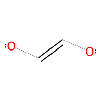 |
| `[O]~[O] + [O]~[O]` | `[O]~[O]=[O]~[O]` |  | 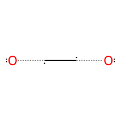 |
| `[CH2]~[O] + [C]~[C]` | `[C]~[C][O]~[CH2]` | 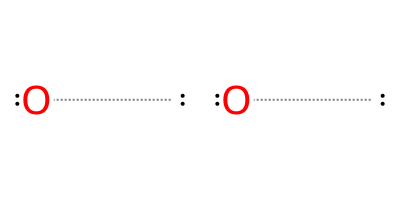 | 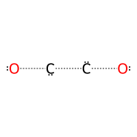 |
| `[C]~[C] + [C]~[C]` | `[C]~[C]#[C]~[C]` |  | 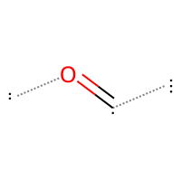 |
| `[O]=[O]` | `[O] + [O]` |  | 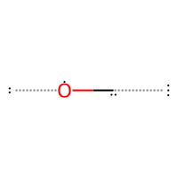 |
| `[CH2]~[O] + [CH2]~[O]` | `[CH2]~[O][CH2]~[O]` | 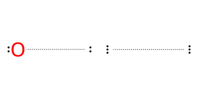 | 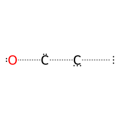 |
| `[O]~[O] + [C]~[C]` | `[C]~[C]~[O]~[O]` |  |  |
| `[CH2]~[O] + [O]~[O]` | `[CH2]~[O]=[O]~[O]` |  |  |
| `[CH]~[CH] + [O]~[O]` | `[CH]~[CH]~[O]~[O]` |  | 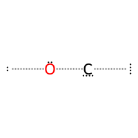 |
| `[CH2]~[CH2] + [CH2]~[O]` | `[CH2]~[CH2]~[O]~[CH2]` |  | 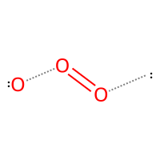 |
| `[CH2]~[CH2] + [C]~[C]` | `[C]~[C]=[CH2]~[CH2]` |  | 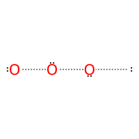 |
| `[CH]~[CH] + [CH]~[CH]` | `[CH]~[CH]=[CH]~[CH]` | 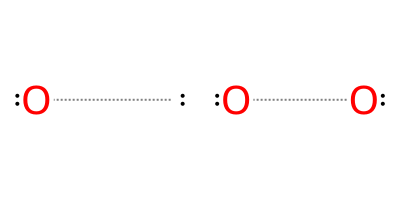 | 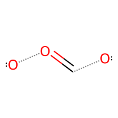 |
| `[O]~[O]` | `[O] + [O]` |  | 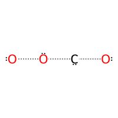 |
| `[CH]~[CH] + [CH2]~[O]` | `[CH]~[CH][CH2]~[O]` | 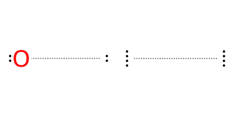 | 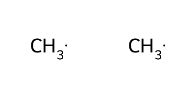 |
| `[C]~[C] + [C]~[C]` | `[C]~[C][C]~[C]` |  | 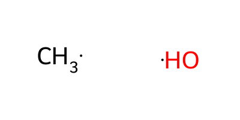 |
| `[CH]~[CH] + [CH]~[CH]` | `[CH]~[CH]#[CH]~[CH]` |  | 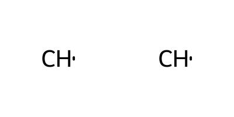 |
| `[OH][OH]` | `[OH] + [OH]` |  |  |
| `[O]~[O] + [O]~[O]` | `[O]~[O][O]~[O]` |  |  |
| `[CH]~[CH] + [CH2]~[CH2]` | `[CH]~[CH][CH2]~[CH2]` |  | 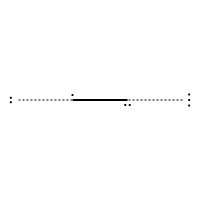 |
| `[O]~[O] + [CH2]~[CH2]` | `[CH2]~[CH2][O]~[O]` |  |  |
| `[CH2]~[CH2] + [CH2]~[O]` | `[CH2]~[CH2]=[O]~[CH2]` | 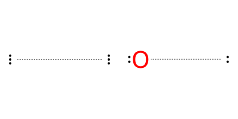 | 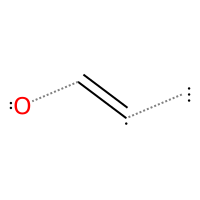 |
| `[CH2]~[CH2] + [C]~[C]` | `[C]~[C][CH2]~[CH2]` |  | 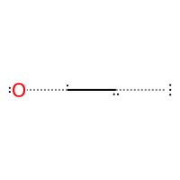 |
| `[CH]~[CH] + [C]~[C]` | `[C]~[C]#[CH]~[CH]` |  | 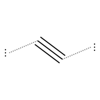 |
| `[CH2]~[CH2] + [O]~[O]` | `[CH2]~[CH2]=[O]~[O]` |  | 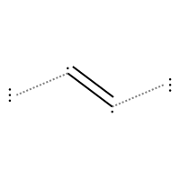 |
| `[CH2]~[O] + [CH2]~[CH2]` | `[CH2]~[CH2][CH2]~[O]` |  | 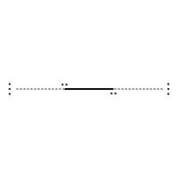 |
| `[O]~[O] + [C]~[C]` | `[C]~[C][O]~[O]` |  |  |
| `[CH2]~[O] + [CH2]~[O]` | `[O]~[CH2]~[CH2]~[O]` |  |  |
| `[C]~[C] + [CH]~[CH]` | `[C]~[C]~[CH]~[CH]` |  |  |
| `[O]~[O] + [CH2]~[O]` | `[O]~[CH2]=[O]~[O]` |  |  |
| `[O]~[O] + [C]~[C]` | `[C]~[C]=[O]~[O]` |  |  |
| `[CH2]~[O] + [CH2]~[O]` | `[O]~[CH2][CH2]~[O]` |  | 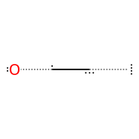 |
| `[CH]~[CH] + [CH]~[CH]` | `[CH]~[CH][CH]~[CH]` |  | 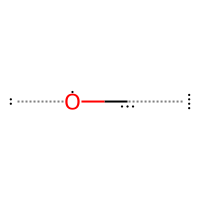 |
| `[O]~[O] + [CH2]~[O]` | `[CH2]~[O][O]~[O]` | 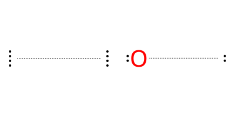 | 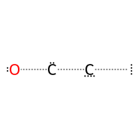 |
| `[CH2]~[O] + [CH2]~[O]` | `[O]~[CH2]=[CH2]~[O]` |  | 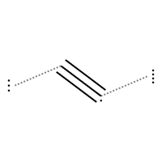 |
| `[C]~[C] + [CH]~[CH]` | `[C]~[C]=[CH]~[CH]` |  | 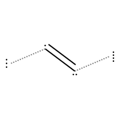 |
| `[CH2]~[O] + [C]~[C]` | `[C]~[C]=[O]~[CH2]` |  |  |
| `[O]~[O] + [CH]~[CH]` | `[CH]~[CH][O]~[O]` |  |  |
| `[CH2]~[CH2] + [CH2]~[CH2]` | `[CH2]~[CH2]~[CH2]~[CH2]` |  |  |
| `[CH2]~[CH2] + [CH2]~[CH2]` | `[CH2]~[CH2][CH2]~[CH2]` |  |  |
| `[CH3][OH]` | `[CH3] + [OH]` |  |  |
| `[C]~[C] + [CH]~[CH]` | `[C]~[C][CH]~[CH]` |  |  |
| `[CH2]~[O] + [CH]~[CH]` | `[CH]~[CH]~[CH2]~[O]` |  |  |
| `[C]~[C]` | `[C] + [C]` |  |  |
| `[CH2]~[O]` | `[CH2] + [O]` |  |  |
| `[CH]~[CH] + [CH2]~[CH2]` | `[CH]~[CH]~[CH2]~[CH2]` |  |  |
| `[CH2]=[CH2]` | `[CH2] + [CH2]` |  |  |
| `[CH2]~[O] + [CH2]~[O]` | `[CH2]~[O][O]~[CH2]` |  |  |
| `[CH2]~[O] + [O]~[O]` | `[O]~[CH2]~[O]~[O]` |  |  |
| `[CH2]~[O] + [CH2]~[O]` | `[CH2]~[O]~[CH2]~[O]` |  |  |
| `[C]~[C] + [C]~[C]` | `[C]~[C]=[C]~[C]` |  |  |
| `[CH]~[CH] + [CH2]~[CH2]` | `[CH]~[CH]=[CH2]~[CH2]` |  |  |
| `[CH]~[CH] + [CH]~[CH]` | `[CH]~[CH]~[CH]~[CH]` |  |  |
| `[C]~[C] + [C]~[C]` | `[C]~[C]$[C]~[C]` |  |  |
| `[CH2]~[O] + [CH2]~[O]` | `[CH2]~[O]=[O]~[CH2]` |  |  |
| `[CH2]~[O] + [CH2]~[O]` | `[CH2]~[O]~[O]~[CH2]` |  |  |
| `[O]~[O] + [O]~[O]` | `[O]~[O]~[O]~[O]` |  |  |
| `[CH]~[CH] + [CH2]~[O]` | `[CH]~[CH]=[CH2]~[O]` |  |  |
| `[CH]#[CH]` | `[CH] + [CH]` |  |  |